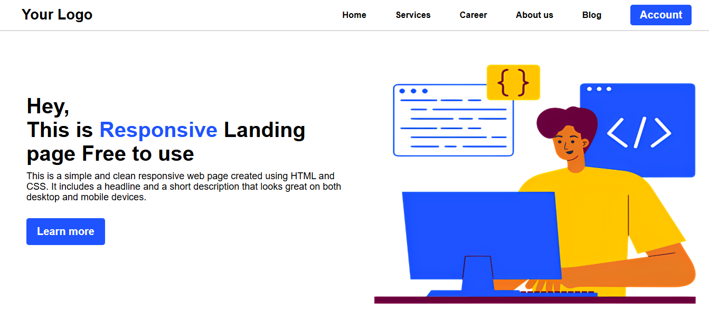
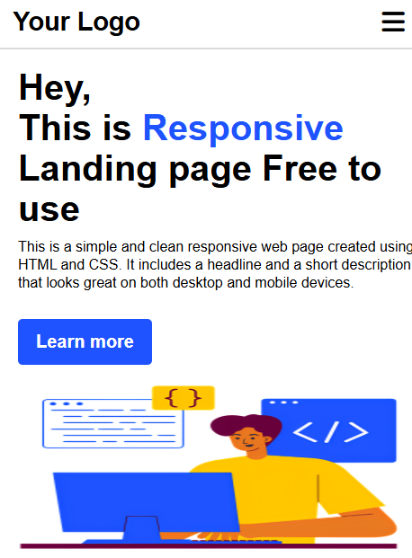

# Responsive Landing Page 🚀

This is a **Responsive Landing Page** built using **HTML** and **CSS**, designed to work seamlessly across desktop and mobile devices. It features a modern layout, navigation bar, and a clean UI perfect for learning and customizing.

## 🔥 Features

- Responsive layout
- Clean and modern design
- Navigation bar with toggle icon (Hamburger menu placeholder)
- Font Awesome integration for icons
- Mobile-friendly structure
- Easy to customize

## 🛠️ Tech Stack

- HTML5
- CSS3
- [Font Awesome 6](https://fontawesome.com/v6/docs)

## 📷 Preview





## 📁 Project Structure
responsive-landing-page/
│

├── index.html

├── style.css

├── study.png

└── README.md


## 🧑‍💻 How to Use

1. **Clone the repository**  
   ```bash
   git clone https://github.com/madanlal.codes/responsive-landing-page.git
Open the project
Open index.html in your browser.

Customize
Modify text, styles, or images to fit your needs.

✅ To-Do
1. Add mobile toggle functionality to the hamburger menu

2. Improve accessibility (ARIA roles, alt texts, etc.)

3. Add animations for better UX

📄 License
This project is open-source and free to use. Feel free to fork and customize!

Made with ❤️ by Madan Lal
